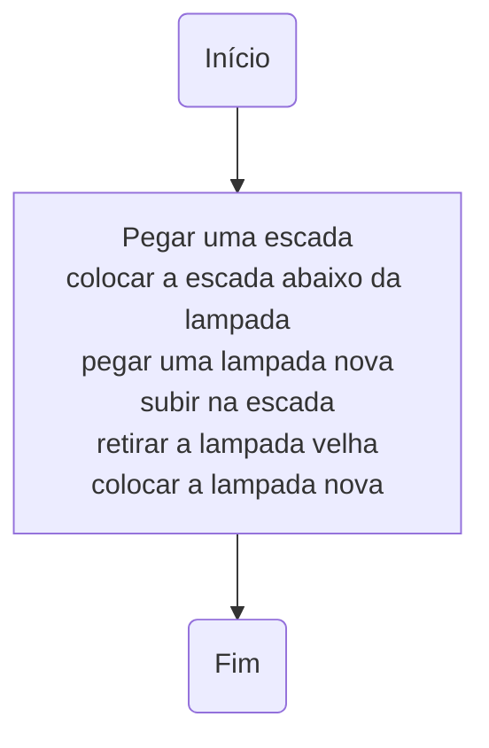

# Lógica de programação

O quê é a lógica?

Estuda a "correção do raciocínio", tem em vista a "ordem da razão"  
(Forbellone, 2006, pg 1).

**Exemplos**
```
Todo mamífero é um animal.
Todo cavalo é um mamífero.
Portanto, Todo cavalo é um animal
```
(Forbellone, 2006, pg 1)

```
Paraná um estado do Brasil.
Todos os cascavelenses são paranaenses.
Logo, todos os cascavelenses são brasileiros.
```

A Lógica de programação consiste na ordem da razão e organização de processos de raciocínio e simbolização formais na programação de sistemas computacionais.

## Algoritmo
Um **algoritmo** é uma sequência de passos organizada, de maneira que a **execução** dos passos possibilita atingir um objetivo.

Junto à idéia de algoritmo vem a noção de **ordem**, na execução dos passos.

**Exemplo**
- Como faríamos para trocar uma lâmpada?

<details>
  <summary>Resposta</summary>

```bash showLineNumbers
pegar uma escada
colocar a escada abaixo da lâmpada
pegar uma lâmpada nova
subir na escada
retirar a lâmpada velha
colocar a lâmpada nova
```
</details>




**Exercício**

Abaixo há um algoritmo para trocar uma lâmpada.
- Ele resolve o problema?
- O que há de errado?

```
colocar a escada abaixo da lâmpada
pegar uma escada
retirar a lâmpada velha
subir na escada
colocar a lâmpada nova
pegar uma lâmpada nova
```

```{dropdown} Resposta
A ordem está incorreta. O algoritmo não resolve o problema, visto que não irá executar corretamente.
```

**Exercício**  
- Três senhoras - dona Branca, dona Rosa e dona Violeta - passeavam pelo parque quando dona Rosa disse:
- Não é curioso que estejamos usando vestidos de cores branca, rosa e violeta, embora nenhuma de nós esteja usando um vestido de cor igual ao seu próprio nome?
- Uma simples coincidência - respondeu a senhora com vestido violeta.

Qual a cor do vestido de cada senhora?  
  
[Forbellone, 2006, pg 12](https://plataforma.bvirtual.com.br/Leitor/Publicacao/323/pdf/)

**Exercício**

- Desenvolva um algoritmo para fazer café.

**Exercício**
- Desenvolva um algoritmo para trocar o pneu de um carro.

**Referências**
- [Forbellone, André Luiz Villar; Eberspätcher, Henri Frederico. Lógica de programação: a construção de algoritmos e estruturas de dados. 4.ed. São Paulo: Pearson Prentice Hall, 2022.](https://plataforma.bvirtual.com.br/Leitor/Publicacao/323/pdf/)
