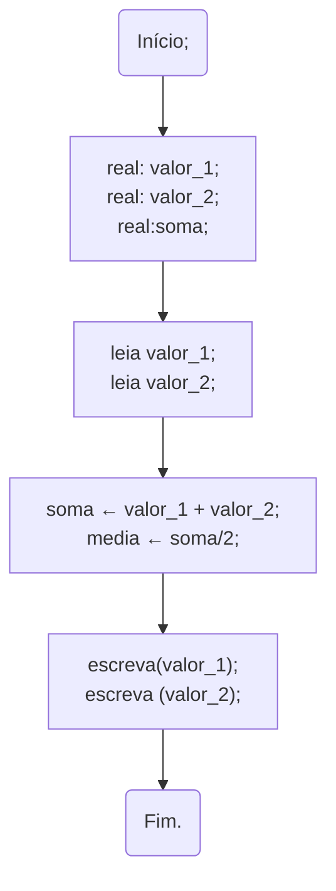
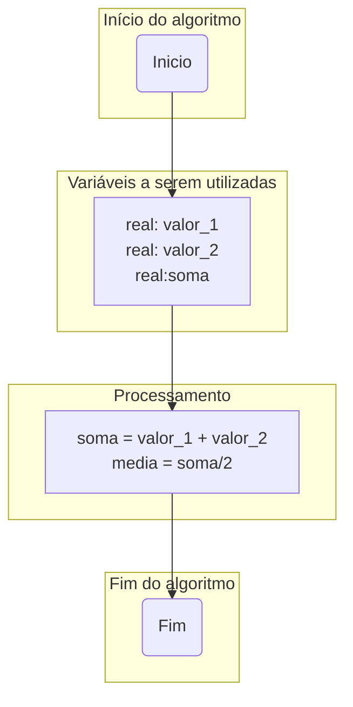

# Representação de algoritmos

Os algoritmos podem ser representados de duas maneiras principais:

1. Textual
1. Fluxograma

Os algoritmos também podem ser representados utilizando os Diagramas de Chapin, porém estes não serão abordados neste material.

## Descritivo

A representação descritiva utiliza texto para expressar o que deve ser executado no algoritmo. Esta é a abordagem tradicional, e cada linha representa uma ação a ser realizada.

**Exemplo**  
- Média de dois números

```
inicio; //Identificação do bloco correspondente ao algoritmo

//Variáveis
inteiro: valor_1, valor_2;
inteiro: soma;
real: media;

//Entrada
leia(valor_1);
leia(valor_2);

//Processamento
soma ← valor_1 + valor_2;
media ← soma / 2;

//Saída
escreva("Média: ", media);


fim; //Fim do algoritmo
```

## Fluxograma




Observe que nos fluxogramas há partes que correspondem ao início, declaração de variáveis, processamento e fim do algoritmo, como apresentado a seguir.



