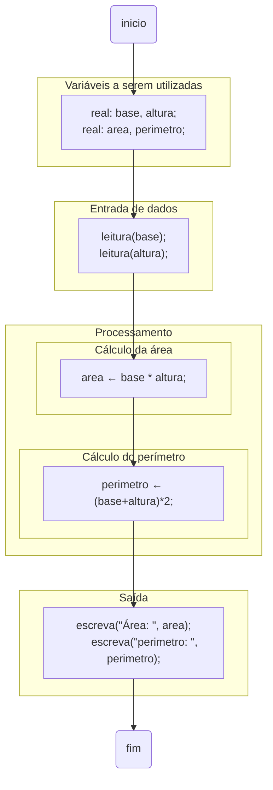

import Tabs from '@theme/Tabs';
import TabItem from '@theme/TabItem';

# Blocos de código

É comum em algoritmos e linguagens de programação a delimitação de trechos de código. A tais delimitações chamamos de bloco.

**Exemplo**  
O exemplo apresentado abaixo apresenta apenas a estrutura para definição de códigos, ele não faz parte da solução de nenhum problema específico. É apenas a ilustração da subdivisão de um código em blocos.

<Tabs groupId='language'>
  <TabItem value="portugol" label="Portugol" default>

  ```c showLineNumbers
  início
    //comando 1
    //comando 2
    // highlight-start
    início              //<-- Início do bloco
        //comando 3
        //comando 4
        //comando 5
    fim;                //<-- Término do bloco
    // highlight-end
    // comando 6
    // comando 7
  fim.
  ```

  Em portugol, os blocos são delimitados por `início` e `fim`.

  Adaptado de ([Forbellone 2022, p. 43](https://plataforma.bvirtual.com.br/Leitor/Publicacao/323/pdf/))


  </TabItem>
  <TabItem value="java" label="Java">

   ```c showLineNumbers
  {
    // comando 1 ;
    // comando 2 ;
    // highlight-start
    {                   //<-- Início do bloco
        // comando 3 ;
        // comando 4 ;
        // comando 5 ;
    }                   //<-- Término do bloco
    // highlight-end
    // comando 6 ;
    // comando 7 ;
  }
  ```

  Em Java, os blocos são delimitados pelas chaves `{` e `}`.

  </TabItem>
  <TabItem value="python" label="Python">

  ```python showLineNumbers
    # comando 1
    # comando 2
    # highlight-start
        # comando 3     #<-- Início do bloco
        # comando 4
        # comando 5     #<-- Término do bloco
    # highlight-end
    # comando 6 ;
    # comando 7 ;
  ```

Em Python, os blocos são definidos pela indentação do código, ou seja, pelo alinhamento no início de cada linha do código. Este alinhamento pode ser feito por caracteres *tab* ou *espaços*.

  </TabItem>
</Tabs>

A ideia é que os blocos agrupem determinadas tarefas dentro do código.

**Exemplo**  

- Calcular e mostrar a área e o perímetro de um retângulo, a partir das informações de sua base e altura.

<Tabs groupId='language'>
  <TabItem value="portugol" label="Portugol" default>

  ```c showLineNumbers
  início
    //Variáveis
    real: base, altura;
    real: area, perimetro;

    //Entrada
    escreva("Base: ");
    leia(base);
    escreva("Altura: ");
    leia(altura);

    //Processamento
    // highlight-start
    início              //<-- Início do bloco
        //Cálculo da área
        area = base * altura;
    fim;                //<-- Término do bloco
    // highlight-end

    // highlight-start
    início              //<-- Início do bloco
        //Cálculo do perímetro
        area = (base + altura)*2;
    fim;                //<-- Término do bloco
    // highlight-end

    //Saída
    escreva("Área     : ", area);
    escreva("Perímetro: ", perimetro);
  fim.
  ```

  Adaptado de ([Forbellone 2022, p. 43](https://plataforma.bvirtual.com.br/Leitor/Publicacao/323/pdf/))


  </TabItem>
  <TabItem value="java" label="Java">

   ```c showLineNumbers
  {
    //Variáveis
    float base, altura;
    float area, perimetro;
    Scanner entrada

    //Entrada
    entrada = new Scanner(System.in);
    System.out.print("Base: ");
    base   = entrada.nextFloat();
    System.out.print("Altura: ");
    altura = entrada.nextFloat();

    //Processamento
    // highlight-start
    { // Cálculo da área  <-- Início do bloco
        
        area = base * altura;
    }                   //<-- Término do bloco
    // highlight-end

    // highlight-start
    { // Cálculo da área  <-- Início do bloco
        
        perimetro = (base + altura)*2;
    }                   //<-- Término do bloco
    // highlight-end

    //Saída
    System.out.printf("Área     : %f", area);
    System.out.printf("Perímetro: %f", perimetro);
  }
  ```

  </TabItem>
  <TabItem value="python" label="Python">

  ```python showLineNumbers
    # Variáveis e entrada
    base   = float(input("Base: "))
    altura = float(input("altura: "))

    # Processamento
    area = base*altura 
    perimetro = (base+altura*2)

    # Saída
    print("Área     : ", area)
    print("Perímetro:", perimetro)
  ```

Em Python, não é possível separar os blocos com este exemplo, utilizando apenas o que aprendemos até aqui. Dado que nesta linguagem a indentação define os blocos, indentá-los resultaria em erro.

  </TabItem>
</Tabs>

Utilizando a representação de algoritmos utilizando fluxogramas, o uso dos blocos se torna mais intuitivo.

**Exemplo**  
- Representação do cálculo da área e perímetro do retângulo utilizando fluxograma.



<!-- style area color:#66f
style perimetro color:#66f -->