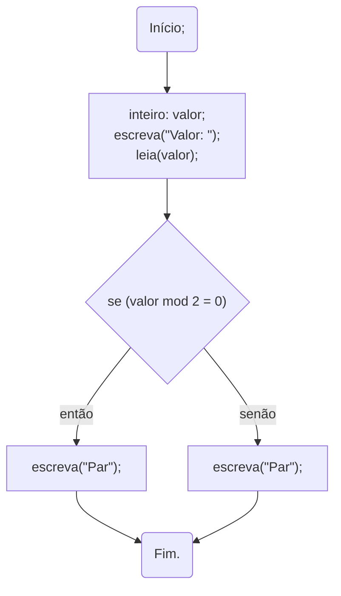

import Tabs from '@theme/Tabs';
import TabItem from '@theme/TabItem';

# Seleção

Uma estrutura de **seleção** possibilita que determinadas ações, ou seja, linhas de um algoritmo, sejam executadas em ou não. A **decisão** se essas linhas serão ou não executadas depende uma **condição** ([FORBELLONE 2022, pg 50](https://plataforma.bvirtual.com.br/Leitor/Publicacao/200078/pdf/75)).


A estrutura de seleção é dada pelo uso da estrutura `se`. Com ela é possível definir *se*  determinado trecho de código seja executado de acordo com determinada **condição**. A **condição** é uma expressão que resulta em `verdadeiro` ou `falso`. Caso o resultado da expressão seja `verdadeiro`, o trecho de código é executado.

## Simples

A seleção **simples** consiste em executar determinado trecho de código caso o resultado da expressão seja verdadeiro.

### Sintaxe

Estrutura do código de seleção simples.

<Tabs groupId='language'>
  <TabItem value="portugol" label="Portugol" default>

  ```c
  se(<expressão>)
    então
      //código a ser executado caso o 
      //resultado da <expressão> seja verdadeiro.
  fimse;
  ```

  </TabItem>
  <TabItem value="java" label="Java">

  ```c
  if(<expressão>)
    //código a ser executado caso o resultado da <expressão> seja verdadeiro.
  ```

  </TabItem>
  <TabItem value="python" label="Python">

  ```python
  if <expressão>:
    #código a ser executado caso o 
    #resultado da <expressão> seja verdadeiro.
  ```

  </TabItem>
</Tabs>

**Exemplo**  
- Peça ao usuário que digite um número inteiro `x`, que corresponde à sua idade em anos. Mostre como saída a mensagem "*Parabéns! Você tem `x` anos!*." E caso a idade do usuário seja maior que 18 anos, também deve ser mostrada a mensagem "*Você é maior de idade.*".

<Tabs groupId='language'>
  <TabItem value="portugol" label="Portugol" default>

  ```c showLineNumbers
  início
  //variáveis
  inteiro: idade;

  //entrada
  escreva("Qual é a sua idade? ");
  leia(idade);
  
  //saída
  escreva("Parabéns! Você tem ", idade, " anos.");
  // highlight-start
  se(idade > 18)
    então
      escreva("Você é maior de idade.");
  fimse;
  // highlight-end
  
  fim.
  ```

  </TabItem>
  <TabItem value="java" label="Java">

  ```c showLineNumbers
  //variáveis
  int idade;
  Scanner entrada;

  //entrada
  entrada = new Scanner(System.in);
  System.out.println("Qual é a sua idade?");
  idade = entrada.nextInt();
  entrada.close();

  //saída
  System.out.printf("Parabéns! Você tem %d anos.\n", idade);
  // highlight-start
  if(idade > 18)
    System.out.println("Você é maior de idade.");
  // highlight-end
  ```

  </TabItem>
  <TabItem value="python" label="Python">

  ```python showLineNumbers
  #variáveis e entrada
  idade = int(input("Qual é a sua idade?"))

  #saída
  print(f"Parabéns! Você tem {idade} anos.")
  # highlight-start
  if idade > 18: print("Você é maior de idade.")
  # highlight-start
  ```

  </TabItem>
</Tabs>

A estrutura apresentada no exemplo pode ser utilizada **apenas** quando o trecho de código a ser executado seja de apenas **uma única linha**. 

### Blocos

Quando o trecho de código é composto de mais de uma linha, precisamos definir um **bloco** com o código a ser executado caso a condição seja verdadeira.

<Tabs groupId='language'>
  <TabItem value="portugol" label="Portugol" default>

  ```c showLineNumbers
  se(<expressão>)
    então
      início
        //código a ser executado caso o 
        //resultado da <expressão> seja verdadeiro.
        //aqui podem existir várias linhas
      fim;
  fimse;
  ```

  </TabItem>
  <TabItem value="java" label="Java">

  ```c showLineNumbers
  if(<expressão>)
  { //<- Início do bloco
    //código a ser executado caso o resultado da <expressão> seja verdadeiro.
    //aqui podem existir várias linhas
  } //<- Fim. do bloco
  ```

  </TabItem>
  <TabItem value="python" label="Python">

  ```python showLineNumbers
  if <expressão>:
    #código a ser executado caso o 
    #resultado da <expressão> seja verdadeiro.
    #aqui podem existir várias linhas
  ```

  </TabItem>
</Tabs>


**Exemplo**

- Peça ao usuário que digite um número $x$. Mostre esse número elevado ao quadrado ($x^2$). E caso o número digitado seja maior que 10, mostre também esse número elevado à terceira ($x^3$) e quarta ($x^4$) potências.

<Tabs groupId='language'>
  <TabItem value="portugol" label="Portugol" default>

  ```c showLineNumbers
  início
  //variáveis
  inteiro: x;
  inteiro: x_elev;

  //entrada
  escreva('Entre com um valor para x: ');
  leia(x);

  //processamento e saída
  xelev ← x*x;
  escreva(x, "^2= ", x_elev);

  se(x>10)
    então
      // highlight-start
      início
        x_elev ← x_elev *x;
        escreva(x, "^3= ", x_elev);
        x_elev ← x_elev *x;
        escreva(x, "^4= ", x_elev);
      fim;
      // highlight-end
  fimse;
  ```

  </TabItem>
  <TabItem value="java" label="Java">

  ```c showLineNumbers
  //variáveis
  int x, x_elev;
  Scanner entrada;

  //entrada
  entrada = new Scanner(System.in);
  x = entrada.nextInt();
  entrada.close();

  //processamento e saída
  x_elev = x*x;
  System.out.printf("%d^2= %d\n", x, x_elev);

  if(<expressão>)
  // highlight-start
  { 
    x_elev = x_elev*x;
    System.out.printf("%d^3= %d\n", x, x_elev);
    x_elev = x_elev*x;
    System.out.printf("%d^4= %d\n", x, x_elev);
  } 
  // highlight-end
  ```

  </TabItem>
  <TabItem value="python" label="Python">

  ```python showLineNumbers
  #variáveis e entrada
  x = int(input("Entre com um valor para x: "))

  #processamento e saída
  x_elev = x*x
  print(f"{x}^2: {x_quad}")
  if x>10:
    # highlight-start
    x_elev = x_elev*x
    print(f"{x}^3: {x_quad}")
    x_elev = x_elev*x
    print(f"{x}^4: {x_quad}")
    # highlight-end
  ```

  </TabItem>
</Tabs>

**Atividades**  

- Desenvolva um algoritmo em que o usuário digita um valor. De acordo com o valor mostre a seguinte mensagem:
    - *"Par"* caso o número digitado seja par;
    - *"Ímpar"* caso o número digitado seja ímpar.
- Peça ao usuário para digitar um número inteiro. De acordo com o número digitado, mostre a mensagem:
    - *"Número positivo"*, caso o número digitado seja positivo;
    - *"Número negativo"*, caso o número digitado seja negativo;
    - *"Número nulo"*, caso o número digitado não seja 0 (não é positivo nem negativo).

- Considere que há uma turma de alunos que participam de uma disciplina sobre Algoritmos e Estruturas de dados, que possui a carga horária de $160$ horas. Desenvolva um algoritmo em que o aluno informa a quantidade de faltas que possui na disciplina, e caso o número de presenças seja inferior a $75\%$ da carga horária, mostre na tela a mensagem *"Número de presenças insuficiente. Aluno reprovado por faltas."*

## Composta

Vamos partir do seguinte exemplo:
- Desenvolva um algoritmo em que o usuário digita um valor. De acordo com o valor mostre a seguinte mensagem:
    - *"Par"* caso o número digitado seja par;
    - *"Ímpar"* caso o número digitado seja ímpar.

<Tabs groupId='language'>
  <TabItem value="portugol" label="Portugol" default>

  ```c showLineNumbers
  início
  //variáveis
  inteiro: valor;
  escreva("Valor: ");
  leia(x);

  //processamento e saída
  se(x mod 2 = 0)           //<-- Verifica se o valor é par
    então 
      início
        escreva("Par");
      fim;
  se(x mod 2 <> 0)          //<-- Verifica se o valor é ímpar
    então
      início
        escreva("Ímpar");
      fim;
  fimse;
  ```

  </TabItem>
  <TabItem value="java" label="Java">

  ```c showLineNumbers
  //variáveis e entrada
  int valor;
  Scanner entrada;
  entrada = new Scanner(System.in);
  System.out.println("Valor: ");
  valor = entrada.nextInt();
  entrada.close();

  //processamento e saída
  if( valor %2 == 0 )       //<-- Verifica se o valor é par
  { 
    System.out.println("Par");
  }
  if( valor %2 != 0 )       //<-- Verifica se o valor é ímpar
  { 
    System.out.println("Ímpar");
  } 

  ```

  </TabItem>
  <TabItem value="python" label="Python">

  ```python showLineNumbers
  #variáveis e entrada
  valor = int(input("Valor: "))

  #processamento e saída
  if x%2==0:        #<-- Verifica se o valor é par
    print("Par")
  if x%2!=0:        #<-- Verifica se o valor é par
    print("Ímpar")
  ```

  </TabItem>
</Tabs>

Observe no algoritmo acima que os testes são realizados duas vezes. E incluse, perceba que os resultados não se sobrepõem, visto que as condição são o inverso uma da outra. Ou o número é par ou é impar, não há como ser ambos simultaneamente.

A seleção composta é uma ampliação da seleção simples. A ideia é que podemos ter duas escolhas, e executar uma (e apenas uma) delas. Uma para o caso do resultado da expressão ser `verdadeiro` e outra para resultado `falso`. 

Podemos executar código caso o resultado da expressão seja `falso` utilizando a palavra `senão`.

### Sintaxe

<Tabs groupId='language'>
  <TabItem value="portugol" label="Portugol" default>

  ```c showLineNumbers
  se(<expressão>)
    então
      início
        //código a ser executado caso o 
        //resultado da <expressão> seja verdadeiro.
        //aqui podem existir várias linhas
      fim;
    // highlight-start
    senão
      início
      //código a ser executado caso o 
        //resultado da <expressão> seja falso.
        //aqui podem existir várias linhas
      fim;
    // highlight-end
  fimse;
  ```

  </TabItem>
  <TabItem value="java" label="Java">

  ```c showLineNumbers
  if(<expressão>)
  {
    //código a ser executado caso o 
    //resultado da <expressão> seja verdadeiro.
    //aqui podem existir várias linhas
  }
  // highlight-start
  else
  {
    //código a ser executado caso o 
    //resultado da <expressão> seja falso.
    //aqui podem existir várias linhas
  }
  // highlight-end
  ```

  </TabItem>
  <TabItem value="python" label="Python">

  ```python showLineNumbers
  if <expressão>:
    #código a ser executado caso o 
    #resultado da <expressão> seja verdadeiro.
    #aqui podem existir várias linhas
  # highlight-start
  else:
    #código a ser executado caso o 
    #resultado da <expressão> seja falso.
    #aqui podem existir várias linhas
  # highlight-end
  ```

  </TabItem>
</Tabs>

Desta forma, o exercício anterior poderia ser resolvido da seguinte maneira:

<Tabs groupId='language'>
  <TabItem value="portugol" label="Portugol" default>

  ```c showLineNumbers
  início
  //variáveis
  inteiro: valor;
  escreva("Valor: ");
  leia(x);

  //processamento e saída
  se(x mod 2 = 0) //<-- Verifica se o valor é par
    então 
      início
        escreva("Par");
      fim;
    // highlight-start
    senão
      início
        escreva("Ímpar");
      fim;
    // highlight-end
  fimse;
  ```

  </TabItem>
  <TabItem value="java" label="Java">

  ```c showLineNumbers
  //variáveis e entrada
  int valor;
  Scanner entrada;
  entrada = new Scanner(System.in);
  System.out.println("Valor: ");
  valor = entrada.nextInt();
  entrada.close();

  //processamento e saída
  if( valor %2 == 0 )
  { 
    System.out.println("Par");
  }
  // highlight-start
  else
  { 
    System.out.println("Ímpar");
  } 
  // highlight-end

  ```

  </TabItem>
  <TabItem value="python" label="Python">

  ```python showLineNumbers
  #variáveis e entrada
  valor = int(input("Valor: "))

  #processamento e saída
  if x%2==0:
    print("Par")
  # highlight-start
  else:
    print("Ímpar")
  # highlight-end
  ```

  </TabItem>
</Tabs>


Podemos observar melhor a solução deste problema utilizando fluxogramas:


Observe que há dois caminhos possíveis, e qual caminho seguir depende do resultado da expressão.


## Encadeada

A seleção encadeada consiste em tratar situações em que não ocorrem apenas duas possibilidades. Nestes casos, o emprego da estrutura `se` ocorre em diversos níveis.

Voltemos ao nosso exemplo dos números positivos, negativos e nulos.

<Tabs groupId='language'>
  <TabItem value="portugol" label="Portugol" default>

  ```c showLineNumbers
  início
  //variáveis
  inteiro: valor;
  escreva("Valor: ");
  leia(valor);

  //processamento e saída
  se(valor > 0) //<-- Verifica se o valor é positivo
    então 
      início
        escreva("Positivo");
      fim;
  se(valor < 0) //<-- Verifica se o valor é negativo
    senão
      início
        escreva("Negativo");
      fim;
  se(valor == 0) //<-- Verifica se o valor é nulo
    senão
      início
        escreva("Nulo");
      fim;
  fimse;
  ```

  </TabItem>
  <TabItem value="java" label="Java">

  ```c showLineNumbers
  //variáveis e entrada
  int valor;
  Scanner entrada;
  entrada = new Scanner(System.in);
  System.out.println("Valor: ");
  valor = entrada.nextInt();
  entrada.close();

  //processamento e saída
  if( valor > 0 )
  { 
    System.out.println("Positivo");
  }
  if( valor < 0 )
  { 
    System.out.println("Negativo");
  }
  if( valor == 0 )
  { 
    System.out.println("Nulo");
  }

  ```

  </TabItem>
  <TabItem value="python" label="Python">

  ```python showLineNumbers
  #variáveis e entrada
  valor = int(input("Valor: "))

  #processamento e saída
  if x>0:
    print("Positivo")
  # highlight-start
  if x<0:
    print("Negativo")
  if x==0:
    print("Nulo")
  # highlight-end
  ```

  </TabItem>
</Tabs>

Neste caso, todas as condições são testadas. Isto pode ser melhorado aninhando estruturas `se`. 

Utilizando estruturas de seleção encadeadas, apenas duas das condições são executas.

<Tabs groupId='language'>
  <TabItem value="portugol" label="Portugol" default>

  ```c showLineNumbers
  início
  //variáveis
  inteiro: valor;
  escreva("Valor: ");
  leia(valor);

  //processamento e saída
  se(valor > 0) //<-- Verifica se o valor é positivo
    então 
      início
        escreva("Positivo");
      fim;
    senão
      início
        se(valor < 0) //<-- Verifica se o valor é negativo apenas se não for positivo
          início
            escreva("Negativo");
          fim;
        senão //<-- O valor é nulo. Não há outra possibilidade
          início
            escreva("Nulo");
          fim;
      fim;
  fimse;
  ```

  </TabItem>
  <TabItem value="java" label="Java">

  ```c showLineNumbers
  //variáveis e entrada
  int valor;
  Scanner entrada;
  entrada = new Scanner(System.in);
  System.out.println("Valor: ");
  valor = entrada.nextInt();
  entrada.close();

  //processamento e saída
  if( valor > 0 )
  { 
    System.out.println("Positivo");
  }
  else
  {
    if( valor < 0 ) //<-- Verifica se o valor é negativo apenas se não for positivo
    { 
        System.out.println("Negativo");
    }
    else //<-- O valor é nulo. Não há outra possibilidade
    { 
        System.out.println("Nulo");
    }
  }
  ```

  </TabItem>
  <TabItem value="python" label="Python">

  ```python showLineNumbers
  #variáveis e entrada
  valor = int(input("Valor: "))

  #processamento e saída
  if x>0:
    print("Positivo")
  # highlight-start
  else:
    if x<0: #<-- Verifica se o valor é negativo apenas se não for positivo
        print("Negativo")
    else: #<-- O valor é nulo. Não há outra possibilidade
        print("Nulo")
  # highlight-end
  ```

  </TabItem>
</Tabs>


