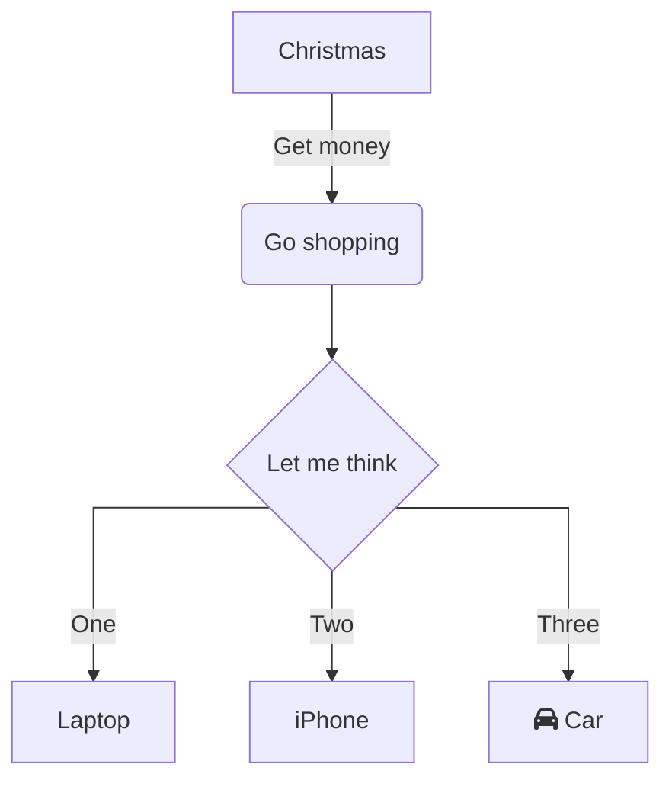

import Tabs from '@theme/Tabs';
import TabItem from '@theme/TabItem';

# Múltipla escolha

Em situações em que precisamos testar diversos valores pontuais, poderíamos utilizar a diversas expressões `se` encadeadas, formando uma seleção encadeada do tipo `se-senão-se`, e testar os possíveis valores.

**Exemplo** 
- A região Sul do Brasil possui três estados. De acordo com o IBGE, cada estado possui uma sigla e um código. Peça ao usuário que digite a sigla do estado, e apresente na tela o nome do estado,  código do estado e em que região do país se encontra. Caso a siga do estado entrada pelo usuário não esteja cadastrada, mostre a mensagem *"Estado ainda não cadastrado no sistema."*.  

:::note Dados

|Sigla do Estado|Código|Estado            |Região|
|---------------|------|------------------|------|
|PR             |41    |Paraná            |Sul   |
|SC             |42    |Santa Catarina    |Sul   |
|RS             |43    |Rio Grande so Sul |Sul   |

Fonte: [IBGE. Códigos dos municípios IBGE.](https://www.ibge.gov.br/explica/codigos-dos-municipios.php)

:::


Uma abordagem para a solução seria testar cada valor de forma encadeada.

<details>
  <summary>Resposta</summary>
<Tabs groupId='language'>

  <TabItem value="pseudocodigo" label="Pseudocódigo">

  ```c
  //Variáveis
  caractere sigla_estado;

  //Entrada
  escreva("Entre com o sigla do estado: ");
  leia(sigla_estado)

  //Processamento e saída
  se (sigla_estado == "PR"): //<- Verifica se o estado é Paraná
  então
    início
      escreva("Estado: Paraná - Sigla: PR - Código: 41 - Região: Sul");
    fim;
  senão
    se (sigla_estado == "SC"): //<- Verifica se o estado é Santa Catarina
    então
      início
        escreva("Estado: Santa Catarina - Sigla: SC - Código: 2 - Região: Sul");
      fim;
    senão
      se (sigla_estado == "RS"): //<- Verifica se o estado é Paraná
      então
        início
          escreva("Estado: Rio Grande do Sul - Sigla: RS - Código: 43 - Região: Sul");
        fim;
      senão //<- Não restou outra opção
        início
          escreva("Estado ainda não cadastrado no sistema.")
        fim.
  fimse;
  fim.

//Saída
System.out.printf("O antecessor de %d é %d\n", valor, antecessor);
System.out.printf("O sucessor de %d é %d\n", valor, sucessor);
  ```

  </TabItem>
  
  <TabItem value="java" label="Java">

  ```c
  //Variáveis
  String sigla_estado;
  Scanner entrada;

  //Entrada
  System.out.println("Entre com o código do estado: ");
  entrada = new Scanner(System.in);
  sigla_estado = entrada.next();
  entrada.close();

  //Processamento e saída
  if (sigla_estado.equals("PR")) //<- Verifica se o estado é Paraná
  {
    System.out.println("Estado: Paraná - Sigla: PR - Código: 41 - Região: Sul");
  }
  else
  {
    if (sigla_estado.equals("SC")) //<- Verifica se o estado é Santa Catarina
    {
      System.out.println("Estado: Santa Catarina - Sigla: SC - Código: 2 - Região: Sul");
    }
    else
      if (sigla_estado.equals("RS")) //<- Verifica se o estado é Paraná
      {
        System.out.println("Estado: Rio Grande do Sul - Sigla: RS - Código: 43 - Região: Sul");
      }
      else //<- Não restou outra opção
      {
        System.out.println("Estado ainda não cadastrado no sistema.");
      }
  }
  ```

  </TabItem>
  <TabItem value="python" label="Python">

  ```python
  #Variáveis e entrada
  sigla_estado = input("Entre com a sigla do estado: ")

  #Processamento e saída
  if sigla_estado == "PR": #<- Verifica se o estado é Paraná
      print("Estado: Paraná - Sigla: PR - Código: 41 - Região: Sul")
  else:
    if sigla_estado == "SC": #<- Verifica se o estado é Santa Catarina
        print("Estado: Santa Catarina - Sigla: Sc - Código: 42 - Região: Sul")
    else:
      if sigla_estado == "RS": #<- Verifica se o estado é Rio Grande do Sul
          print("Estado: Rio Grande do Sul - Sigla: RS - Código: 43 - Região: Sul")
      else: #<- Não restou outra opção
          escreva("Estado ainda não cadastrado no sistema.")
  ```

  </TabItem>
</Tabs>

</details>

Outra forma seria utilizar uma estrutura em que todos os valores fossem testados de uma forma não aninhada, com a estrutura `escolha`.

## Sintaxe

<Tabs groupId='language'>
  <TabItem value="pseudocodigo" label="Pseudocódigo" default>

  ```c
  escolha <variável> //<- variável a ser observada
    caso X: // caso o valor da variável seja X
      //código caso X
    caso Y: // caso o valor da variável seja Y
      //código caso Y
    caso Z: // caso o valor da variável seja Z
      //código caso Z
    caso contrário: //demais casos
      //código demais casos 
  fimescolha;
  ```

  </TabItem>
  <TabItem value="java" label="Java">

  ```js
  switch(<variável>){ //Variável a ser observada
    case X: //Caso o valor da variável seja X
      //Código caso X
      break;
    case Y: //Caso o valor da variável seja Y
      //Código caso Y
      break;
    case Z: //Caso o valor da variável seja Z
      //Código caso Z
      break;
    default: //demais casos
      //Código demais casos
  }
  ```

  </TabItem>
  <TabItem value="python" label="Python">

  Em Python, não há este tipo de estrutura. Porém, pode ser abordada com `elif`, que tem a ideia de `se-senão-se`

  ```python
  if <variável> == X : #Verifica se a variável possui valor X
    #Código caso X
  elif <variável> == Y: #Verifica se a variável possui valor Y
    #Código caso Y
  elif <variável> == Z: #Verifica se a variável possui valor Z
    #Código caso Z
  else: #demais casos
    #Código demais casos
  ```

  </TabItem>
</Tabs>

**Exemplo**  
A solução para o exemplo anterior utilizando `escolha` poderia ser da seguinte forma:

<!-- <details>
  <summary>Resposta</summary> -->
<Tabs groupId='language'>

  <TabItem value="pseudocodigo" label="Pseudocódigo">

  ```c
  início
    //Variáveis
    caractere sigla_estado;

    //Entrada
    escreva("Entre com o sigla do estado: ");
    leia(sigla_estado)

    //Processamento e saída
    escolha sigla_estado //<- Variável a ser observada
      caso "PR": escreva("Estado: Paraná - Sigla: PR - Código: 41 - Região: Sul");
      caso "SC": escreva("Estado: Santa Catarina - Sigla: SC - Código: 2 - Região: Sul");
      caso "RS": escreva("Estado: Rio Grande do Sul - Sigla: RS - Código: 43 - Região: Sul");
      caso contrário: escreva("Estado ainda não cadastrado no sistema.");
    fimescolha;
  fim.
  ```

  </TabItem>
  
  <TabItem value="java" label="Java">

  Em Java, a estrutura que realiza este tipo de operação é o `switch-case`.

  ```c
  //Variáveis
  String sigla_estado;
  Scanner entrada;

  //Entrada
  System.out.println("Entre com o código do estado: ");
  entrada = new Scanner(System.in);
  Sigla_estado = entrada.next();
  entrada.close();

  //Processamento e saída
  // highlight-start
  switch(sigla_estado) //<- Verifica se o estado é Paraná
  // highlight-end
  {
    case "PR":
    {
      System.out.println("Estado: Paraná - Sigla: PR - Código: 41 - Região: Sul");
      break;
    }
    case "SC":
    {
      System.out.println("Estado: Santa Catarina - Sigla: SC - Código: 2 - Região: Sul");
      break;
    }
    case "RS":
    {
      System.out.println("Estado: Rio Grande do Sul - Sigla: RS - Código: 43 - Região: Sul");
      break;
    }
    default:
    {
      System.out.println("Estado ainda não cadastrado no sistema.");
    }
    // highlight-end
  }
  ```

  Em Java, os comandos `break` e `default` são opcionais. Seus significados são:  


  -  `break`: Indica que nenhuma outra opção precisa ser consultada.  
  -  `default`: Esta opção será selecionada caso nenuma das alternativas anteriores seja atingida.  


  </TabItem>
  <TabItem value="python" label="Python">

  ```python
  #Variáveis e entrada
  sigla_estado = input("Entre com a sigla do estado: ")

  #Processamento e saída
  if sigla_estado == "PR": #<- Verifica se o estado é Paraná (verificação inicial)
    print("Estado: Paraná - Sigla: PR - Código: 41 - Região: Sul")
  # highlight-start
  elif sigla_estado == "SC": #<- Verifica se o estado é Santa Catarina
    print("Estado: Santa Catarina - Sigla: Sc - Código: 42 - Região: Sul")
  elif sigla_estado == "RS": #<- Verifica se o estado é Rio Grande do Sul
    print("Estado: Rio Grande do Sul - Sigla: RS - Código: 43 - Região: Sul")
  else: #<- Não restou outra opção
    escreva("Estado ainda não cadastrado no sistema.")
  # highlight-end
  ```

  </TabItem>
</Tabs>

<!-- </details> -->

<details>
  <summary>Fluxograma</summary>

  ```mermaid
  %%{ init: { 'flowchart': { 'curve': 'stepAfter' } } }%%
  graph TD
      inicio("inicio")
      fim("fim.")
      A["caractere: sigla_estado"]
      B("leia(sigla_estado)")
      B --> C{"escolha
      sigla_estado"}
      C -->|"PR"| D["escreva(Paraná)"]
      C -->|"SC"| E["escreva(Santa Catarina)"]
      C -->|"RS"| F["escreva(Rio Grande do Sul)"]
      A --> B
      inicio --> A
      D --> fim
      E --> fim
      F --> fim
  ```

</details>


**Atividades**  
- Amplie a tabela de estados, considerando estados das regiões Sudeste e Centro-Oeste. Além do nome do estado, informe também código do estado, nome da região e código da região.
- Amplie a tabela de estados, para incluir todos os estados do Brasil. Além do nome do estado, informe também código do estado, nome da região e código da região.


## Referências
- [Forbellone, André Luiz Villar; Eberspätcher, Henri Frederico. Lógica de programação: a construção de algoritmos e estruturas de dados. 4.ed. São Paulo: Pearson Prentice Hall, 2022.](https://plataforma.bvirtual.com.br/Leitor/Publicacao/323/pdf/)

