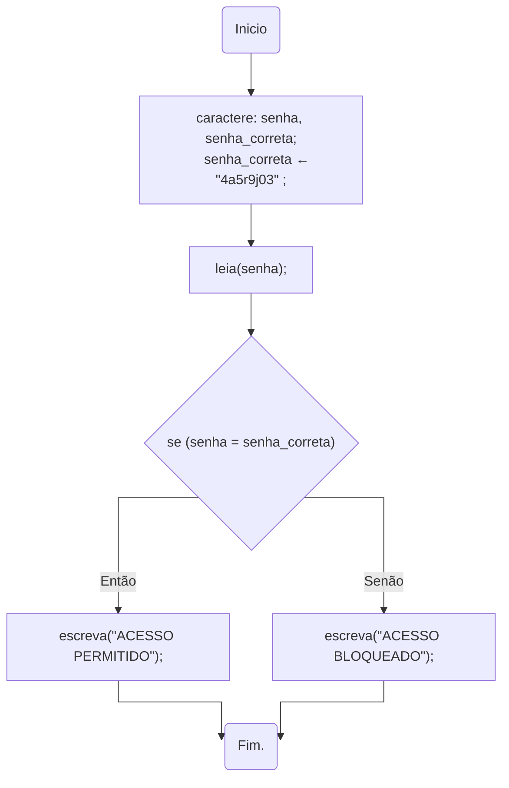

import Tabs from '@theme/Tabs';
import TabItem from '@theme/TabItem';

# Seleção

- Escreva um programa que verifique a validade de uma senha fornecida pelo usuário. A senha válida é o código `4a5r9j03`. Devem ser apresentado na tela a seguinte mensagem:
  - *"ACESSO PERMITIDO"* caso a senha seja válida.  
  - *"ACESSO BLOQUEADO"* caso a senha seja inválida.
  1. Resolva também este problema utilizando fluxograma

<details>
  <summary>Resposta</summary>
<Tabs groupId='language'>
  <TabItem value="fluxograma" label="Fluxograma" default>



  </TabItem>
  <TabItem value="portugol" label="Portugol">

  ```c
  inicio
  //variáveis
  caractere senha_correta, senha;
  senha_correta = "4a5r9j03";

  //entrada
  escreva("Senha: ");
  leia(senha);

  //processamento e saída
  se( senha = senha_correta)
    então
      início
        escreva("ACESSO PERMITIDO");
      fim;
    senão
      início
        escreva("ACESSO BLOQUEADO");
      fim;
  fimse;
  fim.
  ```

  </TabItem>
  <TabItem value="java" label="Java">

  ```c
  //variáveis
  String senha_correta, senha;
  Scanner entrada;
  senha_correta = "4a5r9j03";

  //entrada
  System.out.println("Senha: ");
  entrada = new Scanner(System.in);
  senha = entrada.next();
  entrada.close()

  //processamento e saída
  if(senha.equals(senha_correta))
  {
    System.out.println("ACESSO PERMITIDO");
  }
  else
  {
    System.out.println("ACESSO BLOQUEADO");
  }
  ```

  </TabItem>
  <TabItem value="python" label="Python">

  ```python
  #variáveis e entrada
  senha = input("Senha: ")
  senha_correta = "4a5r9j03"

  //processamento e saída
  if senha == senha_correta:
    print("ACESSO PERMITIDO")
  else:
    print("ACESSO BLOQUEADO")
  ```

  </TabItem>
</Tabs>
</details> 

1. Pergunte 3 números ao usuário. Mostre o menor e o maior números digitados.

1. Pergunte 3 números ao usuário. Mostre esses números em ordem, do menor para o maior.

1. Pergunte 5 números ao usuário. Mostre esses números em ordem, do menor para o maior.

1. Faça um programa que recebe um número inteiro e informa se esse número é divisível por 10, por 5, por 2 ou se não é divisível por nenhum destes.
    1. Desenvolva também a solução para este problema utilizando fluxograma.


1. As maçãs custam R$ 0,30  cada se forem compradas menos do que uma dúzia, e R$ 0,25 se forem compradas pelo menos doze. Escreva um algotitmo que após receber o número de maçãs compradas, calcula e mostra o valor total da compra.

1. Tendo como entrada a altura e o sexo (codificado da seguinte forma: `f`:feminino e `m`:masculino) de uma pessoa, construa um programa que calcule e imprima seu peso ideal, utilizando as seguintes fórmulas:
    - para homens: (72.7 * Altura) – 58  
    - para mulheres: (62.1 * Altura) – 44.

1. Faça um programa em que são solicitados ao ao usuário dois valores (operandos) e um operador, que pode ser `+`, `-`, `*` ou `/`. De acordo com o operador digitado, mostre o resultado da operação.
    1. Desenvolva também a solução para este problema utilizando fluxograma.

1. Ler 3 valores (A, B e C) representando as medidas dos lados de um triângulo e escrever se formam ou não um triângulo.  
    1. Resolva o problema utilizando a estrutura **se** apenas uma vez no algoritmo.  

  :::note

    Para formar um triângulo, o valor de cada lado deve ser menor que a soma dos outros 2 lados.
    
  :::

1. Escreva um programa para ler o número de lados de um polígono regular e a medida do lado (em cm). Calcular e imprimir o seguinte:
    - Se o número de lados for igual a 3 escrever TRIÂNGULO e o valor da área. 
    - Se o número de lados for igual a 4 escrever QUADRADO e o valor da sua área. 
    - Se o número de lados for igual a 5 escrever PENTÁGONO.
    - Acrescente as seguintes mensagens à solução do exercício anterior, conforme o caso.
      - Caso o número de lados seja inferior a 3 escrever NÃO É UM POLÍGONO.
      - Caso o número de lados seja superior a 5 escrever POLÍGONO NÃO IDENTIFICADO.

1. Escreva um programa que recebe um inteiro e diga se esse número é par ou ímpar.  
  :::tip Dica
    Utilize resto da divisão.
  :::

1. Faça um programa para ler um número e imprimir uma mensagem dizendo se tal número é par e positivo ao mesmo tempo.

1. Faça um programa que recebe a idade de um nadador indicar quais em quais categorias esse nadador pode competir. As categorias são:  

    |Idade      |Categoria|
    |-----------|---------|
    |>= 18      |Adulto   |
    |>= 14 e <18|Juvenil  |
    |>=9 e <14  |Infantil |
    |<9         | Mirim   |

    1. Resolva também este problema utilizando fluxograma.

1. Uma empresa abriu uma linha de crédito para os funcionários. O valor da prestação não pode ultrapassar 30% do salário. Faça um programa que receba o salário, o valor do empréstimo e o número de prestações e informe se o empréstimo pode ser concedido. Nenhum dos valores informados pode ser zero ou negativo.

1. Um comerciante comprou um produto e quer vendê-lo com lucro de 45% se o valor da compra for menor que R$ 20,00; caso contrário, o lucro será de 30%. Entrar com o valor do produto e imprimir o valor da venda.

1. Para doar sangue é necessário ter entre 18 e 67 anos. Faça um *software* que pergunte a idade de uma pessoa e diga se ela pode doar sangue ou não.

1. Faça um programa que receba três notas, e com base nelas informa se o aluno foi aprovado ou reprovado. 
    - Média maior ou igual a 7,00: *"ALUNO APROVADO"*
    - Média menor que 7,00: *"ALUNO REPROVADO"*

1. Faça um programa que calcula o desconto previdenciário de determinado funcionário. O desconto deve ser calculado com base no salário do funcionário, sendo este 15.2% do salário. O desconto é limitado de R$ 1000,00. Informe o desconto, tendo como entrada o salário.

1. Desenvolva um programa que informa se determinado aluno está ou não reprovado por faltas. O aluno deve ter 75% de presença na disciplina para ser aprovado.

1. Um comerciante comprou determinado produto, e deseja vendê-lo obtendo 45% de lucro, caso o valor da compra seja menor que R$ 200,00. Caso contrário, o lucro deverá ser de 51%. Implemente um programa que peça o valor de custo do produto e calcule por quanto o produto deve ser vendido.

1. Faça um Programa que peça um número correspondente a um determinado ano e em seguida informe se este ano é ou não bissexto. Para saber se determinado ano é bissexto, ele deve atender a pelo menos um dos seguintes critérios:
    - ser divisível por 4 e não ser divisível por 100;
    - ser divisível por 400.

1. Faça um programa para um caixa eletrônico. O programa deverá perguntar ao usuário a valor que deeja sacar e em seguida informar quantas notas de cada valor serão fornecidas, apresentando o maior número possível de notas de maior valor. As notas disponíveis são de 1, 5, 10, 50 e 100 Reais. O valor mínimo é de R\$ 1,00 real e o máximo de R\$ 600,00. O programa não deve se preocupar com a quantidade de notas existentes na máquina. Exemplos:
    - Para sacar R\$ 256,00 reais:
        - 2 notas de R\$ 100,00
        - 1 nota de R\$ 50,00
        - 1 nota de R\$ 5,00
        - 1 nota de R\$ 1,00
    - Para sacar a quantia de R\$ 399,00 reais:
        - 3 notas de R\$ 100,00 
        - 1 nota de R\$ 50,00
        - 4 notas de R\$ 10,00
        - 1 nota de R\$ 5,00
        - 4 notas de R\$ 1,00

  :::note Observe
    1.  São informadas apenas as notas que serão fornecidas.
    1.  A saída apresenta a palavra *"nota"* com flexão de número (singular e plural).
  :::

  (Fonte: [EstruturaDeDecisao - PythonBrasil](https://wiki.python.org.br/EstruturaDeDecisao))  
1. Faça um programa que faça 5 perguntas para uma pessoa sobre um crime. As perguntas são:
    - "Telefonou para a vítima?"
    - "Esteve no local do crime?"
    - "Mora perto da vítima?"
    - "Devia para a vítima?"
    - "Já trabalhou com a vítima?" 
  O programa deve no final emitir uma classificação sobre a participação da pessoa no crime. Se a pessoa responder positivamente a 2 questões ela deve ser classificada como "Suspeita", entre 3 e 4 como "Cúmplice" e 5 como "Assassino". Caso contrário, ele será classificado como "Inocente".  
    1. Desenvolva também a solução para este problema utilizando fluxograma.

  (Fonte: [EstruturaDeDecisao - PythonBrasil](https://wiki.python.org.br/EstruturaDeDecisao))

1. Um posto está vendendo combustíveis com a seguinte tabela de descontos:

  |Quantidade|Etanol|Gasolina|
  |------------------|--------|--|
  |até 20 litros     |desconto de 3%|desconto de 4%
  |acima de 20 litros|desconto de 5%|desconto de 6%

1. Escreva um algoritmo que leia o número de litros vendidos, o tipo de combustível (codificado da seguinte forma: E-etanol, G-gasolina). Calcule e imprima o valor a ser pago pelo cliente sabendo-se que o preço do litro da gasolina é R\$ 4,50 o preço do litro do etano é R\$ 3,15.   
(Adaptado de [EstruturaDeDecisao - PythonBrasil](https://wiki.python.org.br/EstruturaDeDecisao))

## Exercícios externos

### Beecrowd
1. [Beecrowd 2780 - Basquete de Robôs](https://www.beecrowd.com.br/judge/pt/problems/view/2780)
1. [Beecrowd 3170 - Bolinhas de Natal](https://www.beecrowd.com.br/judge/pt/problems/view/3170)  
1. [Beecrowd 2787 - Xadrez](https://www.beecrowd.com.br/judge/pt/problems/view/2787)
1. [Beecrowd 1044 - Múltiplos](https://www.beecrowd.com.br/judge/pt/problems/view/1044)
1. [Beecrowd 1041 - Coordenadas de um Ponto](https://www.beecrowd.com.br/judge/pt/problems/view/1041)  


:::caution Cuidado
Muitos *websites* de solução de problemas realizam a correção comparando a saída do algoritmo com a saída esperada como solução. Com isto, **toda** a saída do algoritmo deve ser exatamente igual à solução esperada.
:::

:::tip Dica

  Alguns exercícios possuem a entrada de diversos valores de uma única vez. Estes valores estão em uma mesma linha, separados por espaços. Nestes casos, é necessário separar cada valor da entrada.

  Exemplos de leitura de 2 valores inteiros a partir de uma única linha:

  <Tabs groupId='language'>
  <TabItem value="java" label="Java">

  Em Java, a leitura pode ocorrer de maneira normal utilizando a classe `Scanner`.

  ```c
  //variáveis
  int a, b;
  Scanner entrada;

  //Leitura dos dados
  a = entrada.nextInt();
  b = entrada.nextInt();
  ```

  </TabItem>
  <TabItem value="python" label="Python">

  Em Python, é necessário dividir a entrada em diversas partes, com o método `.split()`, e após realizar a leitura, converter para o tipo esperado.

  ```python
  #variáveis e entrada
  a, b = input().split()
  #converte os valores para o tipo de dado esperado
  a = int(a) 
  b = int(b)
  ```

  </TabItem>
</Tabs>

:::