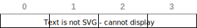

import Tabs from '@theme/Tabs';
import TabItem from '@theme/TabItem';

# Matrizes

Chamaremos de **matrizes** às variáveis compostas multimensionais com duas dimensões. Os casos de mais dimensões serão abordados mais adiante.

Diferente dos vetores, que são variáveis compostas unidimensionais, ou seja, possuem um **único índice** para acessar o elemento armazenado, as matrizes são vetores **multimensionais**. Ou seja, para que um elemento possa ser acessado é necessário que **mais de um índice** seja informado.


**Exemplo**
- índices em variável composta unidimensional (**vetor**) de 4 posições:




**Exemplo**
- índices em variável composta **bidimensional** (**matriz**) de 4 linhas e 4 colunas:


## Alocação estática

**Sintaxe**

<Tabs groupId='language'>
  <TabItem value="pseudocodigo" label="Pseudocódigo" default>

  ```c
  <tipo> [][]: <nome> = {{<valores>}, .. ,{<valores>}}
  ```

  </TabItem>
  <TabItem value="java" label="Java">

  ```javascript
  <tipo>[][] <nome> = { { <valores> }, .. ,{ <valores> } };
  ```

  </TabItem>
  <TabItem value="python" label="Python">

  ```python
  <nome> = [ [ <valores> ], .. ,[ <valores> ] ]
  ```

  </TabItem>
</Tabs>

**Exemplo**

<Tabs groupId='language'>
  <TabItem value="pseudocodigo" label="Pseudocódigo" default>

  ```c
  inteiro [][]: idade = {{20, 22, 18, 40},{37, 20, 12, 65}};                  //armazena informações de idade de 2 grupos com 4 pessoas cada grupo
  real [][]: altura {{1.62, 1.10,  0.23, 1,80} , {1,42, ,1.20, 0.90, 1.40} }; //armazena informações da altura de 2 grupos com 4 pessoas cada grupo
  logico [][] : porta_aberta = {{verdadeiro, falso}, {falso, verdadeiro}};    //armazena informações sobre portas em 2 andares
  ```

  </TabItem>
  <TabItem value="java" label="Java">

  ```javascript
  int[][] idade = { { 1, 2, 3 }, { 4, 5, 6 } };                                 //armazena informações de idade de 2 grupos com 4 pessoas cada grupo
  float [][] altura = {{1.62, 1.10,  0.23, 1,80} , {1,42, ,1.20, 0.90, 1.40} }; //armazena informações da altura de 2 grupos com 4 pessoas cada grupo
  boolean [][] porta_aberta = {{true, false}, {false, true}};                   //armazena informações sobre portas em 2 andares
  ```

  </TabItem>
  <TabItem value="python" label="Python">

  ```python
  idade = [ [ 1, 2, 3 ], [ 4, 5, 6 ] ]                               #armazena informações de idade de 2 grupos com 4 pessoas cada grupo
  altura = [ [1.62, 1.10,  0.23, 1,80] , [1,42, ,1.20, 0.90, 1.40]]; #armazena informações da altura de 2 grupos com 4 pessoas cada grupo
  porta_aberta = [ [True, False], [False, True] ];                   #armazena informações sobre portas em 2 andares
  
  ```

  </TabItem>
</Tabs>

## Acesso a elementos

Para acessar os elementos nas matrizes, é necessário informarmos os índices referentes a cada **linha** e **coluna** da matriz.

**Exemplo**

<Tabs groupId='language'>
  <TabItem value="pseudocodigo" label="Pseudocódigo" default>

  ```c
  //matriz com 2 linhas e 4 colunas
  inteiro [][]: idade = {{20, 22, 18, 40},{37, 20, 12, 65}};
  escreva(idade[0][0]) //20
  escreva(idade[0][1]) //22
  escreva(idade[0][2]) //18
  escreva(idade[0][3]) //40
  escreva(idade[1][0]) //37
  escreva(idade[1][1]) //20
  escreva(idade[1][2]) //12
  escreva(idade[1][3]) //65
  ```

  ou então utilizando estruturas de repetição:
  ```c
  //matriz com 2 linhas e 4 colunas
  inteiro [][]: idade = {{20, 22, 18, 40},{37, 20, 12, 65}};
  inteiro n_linhas = 2, n_colunas = 4, i, j;
  para i de 0 até n_linhas -1 passo 1 faça:
    para j de 0 até n_colunas -1 passo 1 faça:
        escreva(idade[i][j])
    fimpara;
  fimpara;
  ```

  </TabItem>
  <TabItem value="java" label="Java">

  ```javascript
  //matriz com 2 linhas e 4 colunas
  int[][] idade = { { 20, 22, 18, 40 }, { 37, 20, 12, 65 } };
  System.out.println(idade[0][0]) //20
  System.out.println(idade[0][1]) //22
  System.out.println(idade[0][2]) //18
  System.out.println(idade[0][3]) //40
  System.out.println(idade[0][0]) //37
  System.out.println(idade[0][1]) //20
  System.out.println(idade[0][2]) //12
  System.out.println(idade[0][3]) //65
  ```

  ou então utilizando estruturas de repetição:
  ```javascript
  //matriz com 2 linhas e 4 colunas
  int[][] idade = { { 20, 22, 18, 40 }, { 37, 20, 12, 65 } };
  int n_linhas = 2,n_colunas = 4, i, j;
  for(i=0;i<n_linhas, i++){
    for(j=0;j<n_linhas;j++){
        System.out.printf("%d ", idade[i][j]);
    }
    System.out.println("")
  }
  ```
  

  </TabItem>
  <TabItem value="python" label="Python">

  ```python
  # vetor com 2 linhas e 3 colunas
  idade = [ [ 1, 2, 3 ], [ 4, 5, 6 ] ]
  print(idade[0][0])
  print(idade[0][1])
  print(idade[0][2])
  print(idade[1][0])
  print(idade[1][1])
  print(idade[1][2])
  ```
  ou então utilizando estruturas de repetição:
  ```python
  # vetor com 2 linhas e 3 colunas
  idade = [ [ 1, 2, 3 ], [ 4, 5, 6 ] ]
  for i in range(2):
    for j in range(3):
      print(idade[i][j])
  ```


  </TabItem>
</Tabs>

Observe que ao utilizar estruturas de repetição aninhadas. Uma estrutura de repetição **para cada dimensão**.


## Alocação dinâmica

A alocação dinâmica permite que a matriz seja criada durante a execução do algoritmo.


<Tabs groupId='language'>
  
  <TabItem value="java" label="Java">

  ```javascript
  <tipo>[][] <nome>;
  
  <nome> = new tipo[<número de linhas>][<número de colunas>];
  ```

  **Exemplo**

  - Matriz com 3 linhas e 4 colunas


  ```javascript
  //declaração
  int[][] matriz;
  int n_linhas = 3, n_colunas = 4;

  //alocação
  matriz = new int[n_linhas][n_colunas];
  ```


  </TabItem>
  
</Tabs>

## n dimensões