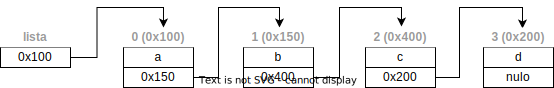
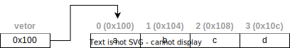
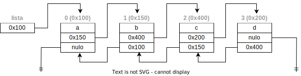
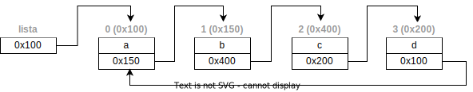
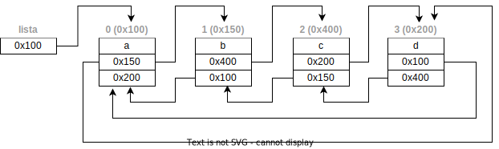

import Tabs from '@theme/Tabs';
import TabItem from '@theme/TabItem';

# Listas

Chamamos de **listas** às estrutura de dados dinâmicas que permitem adicionar, remover e alterar seus elementos. 

Cada elemento de uma lista possui, além do espaço para armazenamento da informação em si, a informação de onde o próximo elemento se encontra na memória. Para efeito de comparação, nos vetores todos os elementos eram alocados de uma única vez. Já nas listas, cada elemento é alocado individualmente.

**Exemplo**  

  
Dados armazenados em uma lista  


  
Dados armazenados em um vetor  


**Sintaxe**

<Tabs groupId='language'>
  <TabItem value="pseudocodigo" label="Pseudocódigo" default>

  ```c
  Lista <<tipo>> <nome> ;
  ```

  </TabItem>
  <TabItem value="java" label="Java">

  ```javascript
  //import java.util.LinkedList
  LinkedList<<tipo>> <nome> = LinkedList<<tipo>>();
  ```
  
  </TabItem>
  <TabItem value="python" label="Python">

  ```python
  <nome> = list()
  ```

  </TabItem>
</Tabs>

**Exemplo**  
- Lista de valores do tipo inteiro

<Tabs groupId='language'>
  <TabItem value="pseudocodigo" label="Pseudocódigo" default>

  ```c
  Lista <inteiro> valores;
  ```

  </TabItem>
  <TabItem value="java" label="Java">

  ```javascript
  //import java.util.LinkedList
  LinkedList<Integer> valores = LinkedList<Integer>();
  ```
  
  </TabItem>
  <TabItem value="python" label="Python">

  ```python
  valores = list()
  ```

  </TabItem>
</Tabs>


E para adicionarmos e removermos elementos


<Tabs groupId='language'>
  <TabItem value="pseudocodigo" label="Pseudocódigo" default>

  ```c
  //obter um elemento armazenado em uma posição específica <p>
  lista_obter(<nome>, <p>); //função retorna o valor armazendo na posição p
  //obter a quantidade de elementos de uma lista
  lista_tamanho(<nome>); // função retorna a quantidade de elementos
  //verificar se a lista está vazia
  lista_vazia(<nome>); // função retorna verdadeiro se não houver nenhum elemento armazenado na lista
  //adicionar um elemento ao final da lista
  lista_acrescentar(<nome>, <valor>); //função modifica a lista passada por parâmetro
  //adicionar um elemento em uma posição específica p
  lista_adicionar(<nome>, <p>, <valor>); //função modifica a lista passada por parâmetro
  //remover um elemento de uma posição específica
  lista_remover(<nome>, <p>); //função modifica a lista passada por parâmetro e retorna o valor removido
  ```

  </TabItem>
  <TabItem value="java" label="Java">

  ```javascript
  //obter um elemento armazenado em uma posição específica <p>
  <nome>.get(p); //retorna o valor armazendo na posição p
  //obter a quantidade de elementos de uma lista
  <nome>.size(); // retorna a quantidade de elementos
  //verificar se a lista está vazia
  <nome>.isEmpty(); // retorna verdadeiro se não houver nenhum elemento armazenado na lista
  //adicionar um elemento ao final da lista
  <nome>.add(valor);
  //adicionar um elemento em uma posição específica p
  <nome>.add(p, valor);
  //remover um elemento de uma posição específica
  <nome>.remove(p) //modifica a lista e retorna o valor removido
  ```

  </TabItem>
  <TabItem value="python" label="Python">

  ```python
  print("Olá Mundo")
  ```
  ```python
  #obter um elemento armazenado em uma posição específica <p>
  <nome>[p] #retorna o valor armazendo na posição p
  #obter a quantidade de elementos de uma lista
  len(<nome>); # retorna a quantidade de elementos
  #verificar se a lista está vazia
  <nome> # usar a lista em if e for retorna verdadeiro se não houver nenhum elemento
  #adicionar um elemento ao final da lista
  <nome>.append(valor)
  #adicionar um elemento em uma posição específica p
  <nome>.insert(p, valor)
  #remover um elemento de uma posição específica
  <nome>.pop(p) #modifica a lista e retorna o valor removido
  ```

  </TabItem>
</Tabs>


**Exemplo**
- neste exemplo é criada uma lista nova, e os seguintes passos são executados:
    - Passo 1: a lista chamada `numeros` é criada, sem elementos
    - Passo 2: são acrescentados elementos com os valores $6$, $15$, $12$ e $30$
    - Passo 3: o elemento da posição $1$ é acessado e mostrado
    - Passo 4: um elemento com valor $10$ é acrescentado na posição $2$
    - Passo 5: o elemento da posição $3$ é removido e mostrado
    - Passo 6: todos os elementos são removidos e mostrados um a um, removendo sempre o último elemento da lista

- Passo 1: a lista chamada `numeros` é criada, sem elementos

<Tabs groupId='language'>
  <TabItem value="pseudocodigo" label="Pseudocódigo" default>

  ```c
  //variáveis
  Lista <inteiro> numeros; //lista
  inteiro: i, valor, n; //variáveis auxiliares
  ```

  </TabItem>
  <TabItem value="java" label="Java">

  ```javascript
  //variáveis
  LinkedList<Integer> numeros = LinkedList<Integer>();//lista
  int: i, valor, n; //variáveis auxiliares
  ```

  </TabItem>
  <TabItem value="python" label="Python">

  ```python
  #variáveis
  numeros = list() #lista
  ```

  </TabItem>
</Tabs>

- Passo 2: são acrescentados elementos com os valores $6$, $15$, $12$ e $30$

<Tabs groupId='language'>
  <TabItem value="pseudocodigo" label="Pseudocódigo" default>

  ```c
  lista_acrescentar(6);
  lista_acrescentar(15);
  lista_acrescentar(12);
  lista_acrescentar(30);
  ```

  </TabItem>
  <TabItem value="java" label="Java">

  ```javascript
  numeros.add(6);
  numeros.add(15);
  numeros.add(12);
  numeros.add(30);
  ```

  </TabItem>
  <TabItem value="python" label="Python">

  ```python
  numeros.append(6)
  numeros.append(15)
  numeros.append(12)
  numeros.append(30)
  ```

  </TabItem>
</Tabs>

- Passo 3: o elemento da posição $1$ é acessado e mostrado

<Tabs groupId='language'>
  <TabItem value="pseudocodigo" label="Pseudocódigo" default>

  ```c
  valor = lista_obter(numeros, 1);
  escreva(valor); //15
  ```

  </TabItem>
  <TabItem value="java" label="Java">

  ```javascript
  valor = numeros.get(1);
  System.out.println(valor); //15
  ```

  </TabItem>
  <TabItem value="python" label="Python">

  ```python
  valor = numeros[1]
  print(valor) #15
  ```

  </TabItem>
</Tabs>

- Passo 4: um elemento com valor $10$ é acrescentado na posição $2$

<Tabs groupId='language'>
  <TabItem value="pseudocodigo" label="Pseudocódigo" default>

  ```c
  lista_adicionar(numeros, 2, 10);
  ```

  </TabItem>
  <TabItem value="java" label="Java">

  ```javascript
  numeros.add(2, 10);
  ```

  </TabItem>
  <TabItem value="python" label="Python">

  ```python
  numeros.insert(2, 10)
  ```

  </TabItem>
</Tabs>

- Passo 5: o elemento da posição $3$ é removido e mostrado

<Tabs groupId='language'>
  <TabItem value="pseudocodigo" label="Pseudocódigo" default>

  ```c
  valor = lista_remover(numeros, 3);
  escreva(valor); //12
  ```

  </TabItem>
  <TabItem value="java" label="Java">

  ```javascript
  valor = numeros.remove(3);
  System.out.println(valor); //12
  ```

  </TabItem>
  <TabItem value="python" label="Python">

  ```python
  valor = numeros.pop(3)
  escreva(valor) #12
  ```

  </TabItem>
</Tabs>

- Passo 6: todos os elementos são removidos e mostrados um a um, removendo sempre o último elemento da lista

<Tabs groupId='language'>
  <TabItem value="pseudocodigo" label="Pseudocódigo" default>

  ```c
  enquanto(não lista_vazia(numeros)) faça         //enquanto houver elementos na lista
      n = lista_tamanho(numeros);          //obtém a quantidade de elementos
      valor = lista_remover(numeros, n-1); //remove o elemento na última posição
      escreva(valor);                      //30, 10, 15 e 6 são mostrados
  fimenquanto;
  ```

  </TabItem>
  <TabItem value="java" label="Java">

  ```javascript
  while(! numeros.isEmpty()){    //enquanto houver elementos na lista
    n = numeros.size();          //obtém a quantidade de elementos
    valor = numeros.remove(n-1); //remove o elemento na última posição
    System.out.println(valor);   //30, 10, 15 e 6 são mostrados
  }
  ```

  </TabItem>
  <TabItem value="python" label="Python">

  ```python
  while numeros:             #enquanto houver elementos na lista
      n = len(numeros)       #obtém a quantidade de elementos
      valor = lista_pop(n-1) #remove o elemento na última posição
      print(valor)           #30, 10, 15 e 6 são mostrados
  ```

  </TabItem>
</Tabs>

<details>
  <summary>Código completo</summary>
  <Tabs groupId='language'>
  <TabItem value="pseudocodigo" label="Pseudocódigo" default>

  ```c
  inicio
    //Passo 1: a lista chamada numeros é criada, sem elementos
    //variáveis
    Lista <inteiro> numeros; //lista
    inteiro: i, valor, n; //variáveis auxiliares

    //Passo 2: são acrescentados elementos com os valores 6, 15, 12 e 30
    lista_acrescentar(6);
    lista_acrescentar(15);
    lista_acrescentar(12);
    lista_acrescentar(30);

    //Passo 3: o elemento da posição 1 é acessado e mostrado
    valor = lista_obter(numeros, 1);
    escreva(valor); //15

    //Passo 4: um elemento com valor 10 é acrescentado na posição 2
    lista_adicionar(numeros, 2, 10);

    //Passo 5: o elemento da posição 3 é removido e mostrado
    valor = lista_remover(numeros, 3);
    escreva(valor); //12

    //Passo 6: todos os elementos são removidos e mostrados um a um, removendo sempre o último elemento da lista
    enquanto(não lista_vazia(numeros)) faça         //enquanto houver elementos na lista
        n = lista_tamanho(numeros);          //obtém a quantidade de elementos
        valor = lista_remover(numeros, n-1); //remove o elemento na última posição
        escreva(valor);                      //30, 10, 15 e 6 são mostrados
    fimenquanto;

  fim.
  ```

  </TabItem>
  <TabItem value="java" label="Java">

  ```javascript
  import java.util.LinkedList;

  class Main{
    public static void main(String[] args){
        //Passo 1: a lista chamada numeros é criada, sem elementos
        //variáveis
        LinkedList<Integer> numeros = LinkedList<Integer>();//lista
        int: i, valor, n; //variáveis auxiliares

        //Passo 2: são acrescentados elementos com os valores 6, 15, 12 e 30
        numeros.add(6);
        numeros.add(15);
        numeros.add(12);
        numeros.add(30);

        //Passo 3: o elemento da posição 1 é acessado e mostrado
        valor = numeros.get(1);
        System.out.println(valor); //15

        //Passo 4: um elemento com valor 10 é acrescentado na posição 2
        numeros.add(2, 10);

        //Passo 5: o elemento da posição 3 é removido e mostrado
        valor = numeros.remove(3);
        System.out.println(valor); //12

        //Passo 6: todos os elementos são removidos e mostrados um a um, removendo sempre o último elemento da lista
        while(! numeros.isEmpty()){      //enquanto houver elementos na lista
            n = numeros.size();          //obtém a quantidade de elementos
            valor = numeros.remove(n-1); //remove o elemento na última posição
            System.out.println(valor);   //30, 10, 15 e 6 são mostrados
        }

    }
  }
  ```

  </TabItem>
  <TabItem value="python" label="Python">

  ```python
  print("Olá Mundo")
  ```

  ```python
  
  #Passo 1: a lista chamada numeros é criada, sem elementos
  #variáveis
  numeros = list() #lista

  #Passo 2: são acrescentados elementos com os valores 6, 15, 12 e 30
  numeros.append(6)
  numeros.append(15)
  numeros.append(12)
  numeros.append(30)

  #Passo 3: o elemento da posição 1 é acessado e mostrado
  valor = numeros[1]
  print(valor) #15

  #Passo 4: um elemento com valor 10 é acrescentado na posição 2
  numeros.insert(2, 10)

  #Passo 5: o elemento da posição 3 é removido e mostrado
  valor = numeros.pop(3)
  escreva(valor) #12

  #Passo 6: todos os elementos são removidos e mostrados um a um, removendo sempre o último elemento da lista
  while numeros:             #enquanto houver elementos na lista
      n = len(numeros)       #obtém a quantidade de elementos
      valor = lista_pop(n-1) #remove o elemento na última posição
      print(valor)           #30, 10, 15 e 6 são mostrados  
  ```

  </TabItem>
</Tabs>
</details>


## Tipos de listas

### Listas duplamente encadeadas

As listas **duplamente encadeadas** são as listas que, além do endereço do elemento seguinte possuem também o endereço do **elemento anterior**.  

**Exemplo**  

  
Lista duplamente encadeada

### Listas circulares

As **listas circulares** são um tipo especial de lista, em que o último elemento da lista tem como próximo o primeiro elemento.

  
Lista circular

#### Listas circulares duplamente encadeadas

As listas circulares também podem ser duplamente encadeadas

  
Lista circular duplamente encadeada
